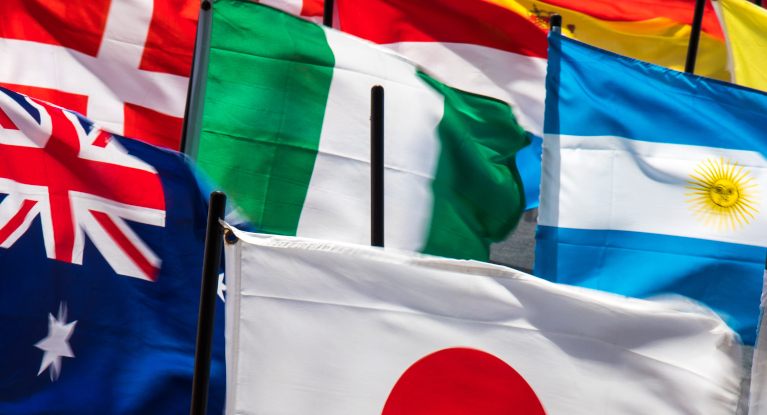

# Country Flags



Dataset and SVG vector files obtained from [CountryFlags](https://www.countryflags.com/en/). There are 196 observations (countries) and 29 features. Dataset are available in different formats:

- JSON
- CSV
- pickle (pandas dataframe)

## Dataset

### .dtypes

```
country                   object
capital                   object
continent                 object
languages                 object
government                object
population                 int64
flag_height              float64
flag_width               float64
flag_colors               object
flag_tags                 object
first_flag_usage          object
adoption_current_flag     object
last_change_flag          object
surface_sqmi               int64
surface_km2                int64
density_sqmi               int64
density_km2                int64
border_len_mi              int64
border_len_km              int64
currency                  object
cet                       object
cest                      object
internet_tld              object
country_letter_code       object
country_digit_code        object
calling_code              object
borders_to                object
countryflags_url          object
image_name                object
```


### .head()

|    | country                               | capital          | continent     | languages        | government                                    |   population |   flag_height |   flag_width | flag_colors                          | flag_tags                                    | first_flag_usage   |   adoption_current_flag | last_change_flag   |   surface_sqmi |   surface_km2 |   density_sqmi |   density_km2 |   border_len_mi |   border_len_km | currency                     | cet                                          | cest                   | internet_tld   | country_letter_code   |   country_digit_code |   calling_code | borders_to                                                                                                             | countryflags_url                                               | image_name                        |
|---:|:--------------------------------------|:-----------------|:--------------|:-----------------|:----------------------------------------------|-------------:|--------------:|-------------:|:-------------------------------------|:---------------------------------------------|:-------------------|------------------------:|:-------------------|---------------:|--------------:|---------------:|--------------:|----------------:|----------------:|:-----------------------------|:---------------------------------------------|:-----------------------|:---------------|:----------------------|---------------------:|---------------:|:-----------------------------------------------------------------------------------------------------------------------|:---------------------------------------------------------------|:----------------------------------|
|  0 | China                                 | Peking (Beijing) | Asia          | Standard Chinese | Socialist one-party state                     |   1374170000 |             2 |            3 | ['red', 'yellow']                    | ['plain', 'stars']                           | 1949               |                    1949 | -                  |        3705407 |       9596961 |            371 |           143 |           13762 |           22147 | chinese yuan ¥ or 元 (cny)   | utc+08:00                                    | utc+08:00              | cn             | chn                   |                  156 |            +86 | ['afghanistan', 'bhutan', 'india', 'kazakhstan', 'korea, north', 'kyrgyzstan', 'laos', 'mongolia', 'myanmar', 'nepal'] | https://www.countryflags.com/en/flag-of-china.html             | china-flag.svg                    |
|  1 | India                                 | New-Delhi        | Asia          | Hindi            | Federal parliamentary constitutional republic |   1282650000 |             2 |            3 | ['blue', 'orange', 'white', 'green'] | ['circles', 'emblem', 'horizontal stripes']  | -                  |                    1947 | -                  |        1269219 |       3287263 |           1011 |           390 |           87633 |          141031 | indian rupee ₹ (inr)         | utc+05:30                                    | utc+05:30              | in             | ind                   |                  356 |            +91 | ['bangladesh', 'bhutan', 'china', 'myanmar', 'nepal', 'pakistan', 'sri lanka']                                         | https://www.countryflags.com/en/flag-of-india.html             | india-flag.svg                    |
|  2 | The United States - The USA - America | Washington, D.C. | North America | English          | Federal presidential constitutional republic  |    324220410 |            10 |           19 | ['blue', 'red', 'white']             | ['horizontal stripes', 'rectangle', 'stars'] | 1818               |                    1960 | 1960               |        3678190 |       9526468 |             88 |            34 |            7478 |           12034 | united states dollar $ (usd) | utc−04:00 to utc−12:00, utc+10:00, utc+11:00 | utc−04:00 to utc−10:00 | us             | usa                   |                  840 |             +1 | ['canada', 'mexico']                                                                                                   | https://www.countryflags.com/en/flag-of-united-states-the.html | united-states-of-america-flag.svg |
|  3 | Indonesia                             | Jakarta          | Asia          | Indonesian       | Unitary presidential constitutional republic  |    258705000 |             2 |            3 | ['red', 'white']                     | ['horizontal stripes']                       | 1881               |                    1945 | 1881               |         735358 |       1904569 |            352 |           136 |            1758 |            2830 | indonesian rupiah rp (idr)   | utc+07:00 to utc+09:00                       | utc+07:00 to utc+09:00 | id             | idn                   |                  360 |            +62 | ['east timor', 'malaysia', 'papua new guinea']                                                                         | https://www.countryflags.com/en/flag-of-indonesia.html         | indonesia-flag.svg                |
|  4 | Brazil                                | Brasília         | South America | Portuguese       | Federal presidential constitutional republic  |    205338000 |             7 |           10 | ['blue', 'green', 'yellow', 'white'] | ['circles', 'stars', 'text', 'triangles']    | 1889               |                    1992 | 1992               |        3287956 |       8515767 |             62 |            24 |            9129 |           14691 | brazilian real r$ (brl)      | utc−02:00 to −05:00                          | utc−02:00 to −05:00    | br             | bra                   |                  076 |            +55 | ['bolivia', 'argentina', 'colombia', 'guyana', 'paraguay', 'peru', 'suriname', 'uruguay', 'venezuela']                 | https://www.countryflags.com/en/flag-of-brazil.html            | brazil-flag.svg                   |

### .tail()

|     | country                     | capital      | continent   | languages         | government                                                                  |   population |   flag_height |   flag_width | flag_colors                        | flag_tags                                          | first_flag_usage   |   adoption_current_flag | last_change_flag   |   surface_sqmi |   surface_km2 |   density_sqmi |   density_km2 |   border_len_mi |   border_len_km | currency                                     | cet       | cest      | internet_tld   | country_letter_code   |   country_digit_code |   calling_code | borders_to   | countryflags_url                                          | image_name            |
|----:|:----------------------------|:-------------|:------------|:------------------|:----------------------------------------------------------------------------|-------------:|--------------:|-------------:|:-----------------------------------|:---------------------------------------------------|:-------------------|------------------------:|:-------------------|---------------:|--------------:|---------------:|--------------:|----------------:|----------------:|:---------------------------------------------|:----------|:----------|:---------------|:----------------------|---------------------:|---------------:|:-------------|:----------------------------------------------------------|:----------------------|
| 191 | Palau                       | Ngerulmud    | Oceania     | Palauan, English  | Unitary presidential constitutional republic under a non-partisan democracy |        21300 |             5 |            8 | ['blue', 'yellow']                 | ['circles', 'plain']                               | 1981               |                    1981 | 1981               |            177 |           459 |            120 |            46 |               0 |               0 | united states dollar $ (usd)                 | utc+09:00 | utc+09:00 | pw             | plw                   |                  585 |           +680 | []           | https://www.countryflags.com/en/flag-of-palau.html        | palau-flag.svg        |
| 192 | Tuvalu                      | Funafuti     | Oceania     | Tuvaluan, English | Non-partisan parliamentary democracy under constitutional monarchy          |        10640 |             1 |            2 | ['blue', 'red', 'yellow', 'white'] | ['rectangle', 'stars', 'union jack']               | 1978               |                    1997 | 1997               |             10 |            26 |           1060 |           409 |               0 |               0 | australian dollar $ (aud), tuvaluan dollar $ | utc+12:00 | utc+12:00 | tv             | tuv                   |                  798 |           +688 | []           | https://www.countryflags.com/en/flag-of-tuvalu.html       | tuvalu-flag.svg       |
| 193 | Nauru                       | Yaren        | Oceania     | Nauruan, English  | Non-partisan democracy Parliamentary republic                               |        10084 |             1 |            2 | ['blue', 'yellow', 'white']        | ['horizontal stripes', 'stars']                    | 1968               |                    1968 | 1968               |              8 |            21 |           1244 |           480 |               0 |               0 | australian dollar $ (aud), nauruan dollar $  | utc+12:00 | utc+12:00 | nr             | nru                   |                  520 |           +674 | []           | https://www.countryflags.com/en/flag-of-nauru.html        | nauru-flag.svg        |
| 194 | Niue                        | Alofi        | Oceania     | Niuean, English   | Unitary parliamentary constitutional monarchy                               |         1470 |             1 |            2 | ['yellow']                         | ['circles', 'rectangle', 'stars', 'union jack']    | -                  |                    1975 | -                  |            100 |           260 |             15 |             6 |               0 |               0 | new zealand dollar $ (nzd), niue dollar $    | utc-11:00 | utc-11:00 | nu             | niu                   |                  570 |           +683 | []           | https://www.countryflags.com/en/flag-of-niue.html         | niue-flag.svg         |
| 195 | Vatican City - the Holy See | Vatican City | Europe      | Italian           | Absolute monarchy, ecclesiastical and elective theocracy                    |          839 |             1 |            1 | ['yellow', 'white']                | ['crowns', 'emblem', 'square', 'vertical stripes'] | -                  |                    1929 | -                  |              0 |             0 |           4939 |          1907 |               2 |               3 | euro € (eur)                                 | utc+01:00 | utc+02:00 | va             | vat                   |                  336 |          +3906 | ['italy']    | https://www.countryflags.com/en/flag-of-vatican-city.html | vatican-city-flag.svg |

### .describe()

|       |    population |   flag_height |   flag_width |     surface_sqmi |      surface_km2 |   density_sqmi |   density_km2 |   border_len_mi |   border_len_km |
|:------|--------------:|--------------:|-------------:|-----------------:|-----------------:|---------------:|--------------:|----------------:|----------------:|
| count | 196           |     196       |    196       |    196           |    196           |        196     |       196     |          196    |          196    |
| mean  |   3.73924e+07 |       3.71429 |      6.09101 | 263115           | 681466           |        755.148 |       291.571 |         1999.96 |         3218.6  |
| std   |   1.38842e+08 |      13.6757  |     24.114   | 735406           |      1.90469e+06 |       3760.41  |      1451.9   |         6458.6  |        10394.1  |
| min   | 839           |       1       |      1       |      0           |      0           |          5     |         2     |            0    |            0    |
| 25%   |   1.8283e+06  |       1       |      2       |   8935.25        |  23141.5         |         87.25  |        33.75  |          204.25 |          328.75 |
| 50%   |   8.43011e+06 |       2       |      3       |  45576.5         | 118042           |        210.5   |        81     |         1013    |         1630.5  |
| 75%   |   2.62539e+07 |       2       |      3       | 199550           | 516832           |        505.5   |       195     |         2340.5  |         3767.25 |
| max   |   1.37417e+09 |     189       |    335       |      6.60167e+06 |      1.70982e+07 |      48466     |     18713     |        87633    |       141031    |

## Vector images

For each observation (country) there exist a corresponding SVG vector image in the subfolder `flags/`.